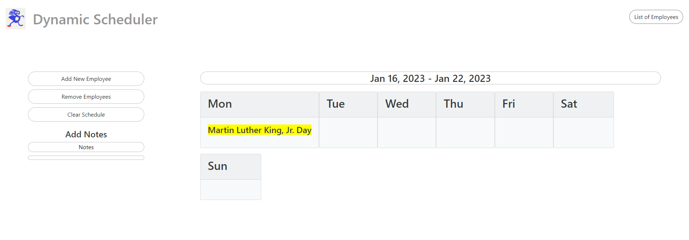

# Dynamic-Scheduler
With so many small businesses still making schedules manually with pen and paper, this Dynamic Scheduler is geared towards those companies with less than 25 total employees by helping them with the task of schedule creation. 

## Description
This easy to use application has many features that will assist any smaller business with saving time and effort when creating a schedule.     These features include:
* A navigation bar that has a link to a list of all employees on staff as well as if they are full time, part time, and their available days.
* A weekly calender that displays the work schedule for the current week as well as any Federally recognized holidays.
* A management control panel that contains an area to add a new employee, as well as a area to remove an employee from staff.
* A notes area that anyone can edit/add notes that contains any notes that may be important for the manager to see daily.

## Resources 
* <a href="https://date.nager.at/Api">List of Federal Holidays</a> 
* <a href="https://day.js.org/">Displays current date</a>

## Contributors
* <a href="https://github.com/codex-scribe">Matt Brandenburgh</a>
* <a href="https://github.com/jakester101">Jacob Hester</a>
* <a href="https://github.com/Melona-png">Madison Woodward</a>
* <a href="https://github.com/jjray84">Jonathan Ray</a>

## Screenshot

## Live Link
-https://jjray84.github.io/Dynamic-Scheduler/
